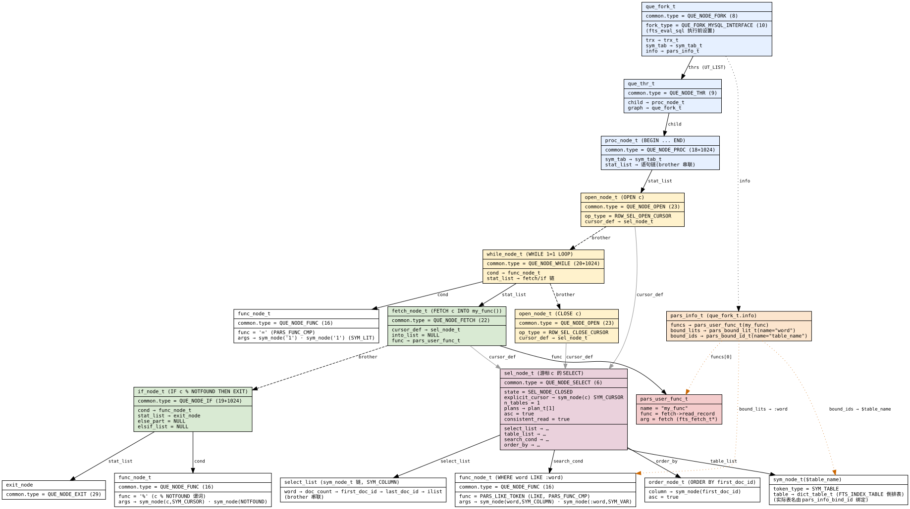

## 概述

- 词法解析器：`pars0lex.l`
- 语法解析器：`pars0grm.y`

执行流程：

```cpp
fts_index_fetch_nodes
  ├─ pars_info_create / pars_info_bind_id("table_name")   ← 绑定 $table_name
  ├─ pars_info_bind_function("my_func", fetch->read_record, fetch)
  ├─ pars_info_bind_varchar_literal("word", ...)          ← 绑定 :word
  ├─ *graph = fts_parse_sql(...)     → pars_sql → yyparse → que_fork_t
  └─ for(;;) fts_eval_sql(trx, *graph)
        ├─ graph->trx = trx
        ├─ graph->fork_type = QUE_FORK_MYSQL_INTERFACE
        ├─ que_fork_start_command(graph) → que_thr_t
        └─ que_run_threads(thr)          ← 真正执行图
```

查询倒排表的 SQL：

```sql
PROCEDURE P() IS
  DECLARE FUNCTION my_func;
  DECLARE CURSOR c IS
    SELECT word, doc_count, first_doc_id, last_doc_id, ilist
    FROM $table_name
    WHERE word LIKE :word
    ORDER BY first_doc_id;
  BEGIN
    OPEN c;
    WHILE 1 = 1 LOOP
      FETCH c INTO my_func();
      IF c % NOTFOUND THEN
        EXIT;
      END IF;
    END LOOP;
    CLOSE c;
  END;
END;
```

调用 `fts_parse_sql` 对上述 SQL 进行解析，生成可执行的 Query Graph，再调用 `fts_eval_sql` 执行该 Query Graph。

## 生成 Query Graph

### 解析函数定义

处理 `my_func` 时，匹配 `PARS_ID_TOKEN`，执行动作 `sym_tab_add_id`，申请名为 `my_func` 的 `sym_node_t` 节点，保存到全局变量 `pars_sym_tab_global` 的 `sym_list` 链表中。

`DECLARE FUNCTION my_func;` 匹配 `function_declaration` 规则，执行动作 `pars_function_declaration`，检查 `my_func` 是否已经注册，并返回词法分析器中申请的 `my_func` 对象。

`my_func` 在之前的代码中已通过 `pars_info_bind_function` 注册到 `pars_info_t` 中。随后，`pars_info_t` 被保存到全局符号表的 `pars_sym_tab_global->info` 中，供 `pars_function_declaration` 校验。

### 解析 cursor

cursor 由名称和一条简单的 `select_statement` 组成，SELECT 部分也被称作 cursor definition。

- cursor 的名称 `c` 与 `my_func` 类似，匹配 `PARS_ID_TOKEN`，经 `sym_tab_add_id` 处理后返回 `sym_node_t`。
- `select_statement` 经 `pars_select_statement` 函数解析后返回 `sel_node_t`。

`pars_cursor_declaration` 接收并处理 `sym_node_t` 和 `sel_node_t`，将 `sym_node_t` 的 `token_type` 设置为 `SYM_CURSOR`，并将两者关联起来。

### 解析 procedure body

procedure body 位于 `BEGIN` 和 `END` 之间，由一系列 statement 构成（`statement_list`），包括控制语句、赋值语句和 SQL 语句等。不同的 statement 对应不同的 `pars_*_statement` 函数。

各个 statement 匹配后，都会通过 `que_node_list_add_last` 函数串联到 `que_common_t` 的 `brother` 链表上（`que_common_t` 是所有 statement 共有的部分，所有 statement 数据结构都包含 `que_common_t`）。

`statement_list` 最终返回链表的头节点。

#### 解析 open c

匹配 `open_cursor_statement` 规则，执行 `pars_open_statement` 动作，返回 `open_node_t` 对象，其 `type` 为 `ROW_SEL_OPEN_CURSOR`。

pars_open_statement 中调用 `pars_resolve_exp_variables_and_types` 对 `c` 进行解析，从 `pars_sym_tab_global->sym_list` 中找到 cursor definition。cursor definition 会被保存到新申请的 `open_node_t` 节点上，并返回给上层。

#### 解析 while

匹配 `while_statement`，执行 `pars_while_statement` 动作，返回 `while_node_t` 对象。

while 由循环条件和循环体组成，循环体也是一系列 statement。

`pars_while_statement` 会将 while 循环体中所有 statement 节点的 `parent` 设为新申请的 `while_node_t` 对象。

##### 解析 1 = 1

本例的 while condition 是 `1 = 1`。解析器执行 `pars_op('=', $1, $3);`，生成一个 `func_node_t` 对象，其 `func` 为 `=`，`fclass` 为 `PARS_FUNC_CMP`。

`1` 匹配 `PARS_INT_LIT`，调用 `sym_tab_add_int_lit` 生成 `token_type` 为 `SYM_LIT` 的 `sym_node_t` 对象，并将其保存到 `func_node_t` 的 `args` 成员变量中。

##### 解析 fetch

通过 fetch 可以遍历 cursor，既支持将 cursor 当前值保存到 user variable 中，也支持交给自定义函数处理。

fetch 匹配 `fetch_statement`，执行 `pars_fetch_statement` 动作，返回 `fetch_node_t` 对象。

本例将 cursor 交给 `my_func` 处理。`my_func` 通过 `pars_info_bind_function` 注册，并被保存到 `fetch_node_t->func` 中。

##### 解析 if

if 匹配 `if_statement`，执行 `pars_if_statement` 动作，返回 `if_node_t` 对象。

`c % NOTFOUND` 用于判断 cursor 是否遍历结束，属于表达式。解析过程参见[解析表达式](#解析表达式)：它生成一个 `func_node_t`，其 `func` 为 `PARS_NOTFOUND_TOKEN`，`fclass` 为 `PARS_FUNC_PREDEFINED`；在 eval 时调用 `eval_notfound` 判断 cursor 是否遍历完。

exit 匹配 `exit_statement`，执行 `pars_exit_statement` 动作，返回 `exit_node_t` 对象。

#### 解析 close c

匹配 `close_cursor_statement` 规则，执行 `pars_open_statement` 动作，返回 `open_node_t` 对象，type 是 `ROW_SEL_CLOSE_CURSOR`。

### 解析表达式

`pars0grm.y` 中的表达式对应规则 `exp`，目前支持的表达式数量较少，主要包括运算符和函数。运算符通过 `pars_op` 处理，函数通过 `pars_func` 处理，两者都返回 `func_node_t` 类型的对象。

## 解析 procedure

最终，调用 `pars_procedure_definition` 完成整个存储过程的解析，返回执行图 `que_fork_t`。

`pars_procedure_definition` 调用 `que_fork_create` 创建 fork，调用 `que_thr_create` 为 fork 创建一个 `que_thr_t`；创建一个 `proc_node_t` 类型实例 `node`，标记 node 和 thr 的父子关系。

### 最终 Query Graph

最终生成的 Query Graph 如下图所示：


