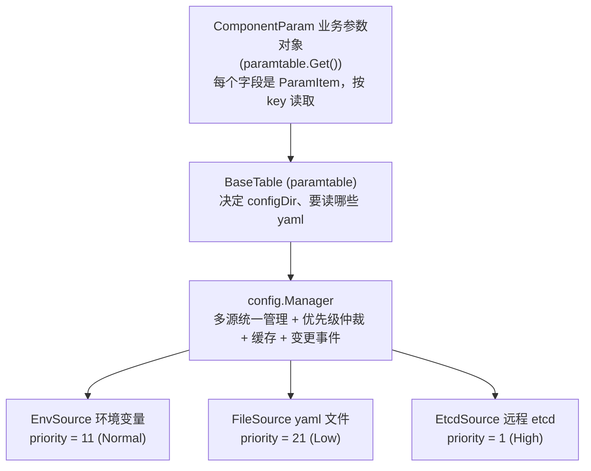
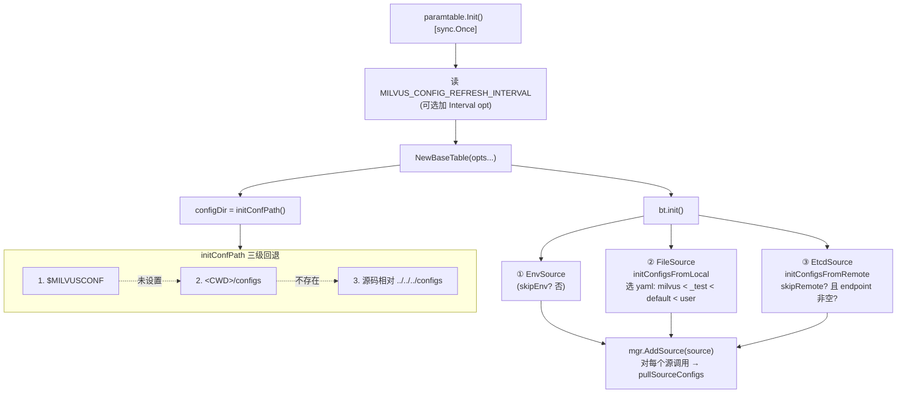
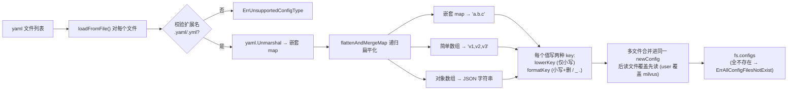

Milvus 的配置系统采用**分层 + 多源合并**的设计：多个「配置源(Source)」并存，由 `config.Manager` 按优先级仲裁出每个 key 的最终生效值，并支持动态刷新。


## 整体架构



## 四种源的优先级


| 源 | priority | 可热刷新 | 典型来源 |
|---|---|---|---|
| overlay | 最高 | 是（运行时 `SetConfig`） | 单测 / 运行时热改 |
| Etcd | 1 (High) | 是（watch） | 集群下发 |
| Env | 11 (Normal) | 否 | 容器环境变量 |
| File | 21 (Low) | 是（5s 轮询） | yaml 文件 |

最终生效优先级（高→低）：**overlay > Etcd > Env > File**。

## 初始化流程

`paramtable.Init()`（`sync.Once` 只跑一次）挂载三类源：




## 配置目录与文件选择

**目录定位** `initConfPath()`

三级回退，命中即用：

1. `MILVUSCONF` 环境变量
2. `<当前工作目录>/configs`
3. 相对源码所在目录回退到仓库根的 `configs`（`runtime.Caller(0)` 推算）


**文件与顺序**（`defaultYaml`）：

```go
defaultYaml = ["milvus.yaml", "_test.yaml", "default.yaml", "user.yaml"]
```

- 顺序即优先级：`milvus < _test < default < user`（后者覆盖前者）。
- 这 4 个文件同属**一个** `FileSource`，靠 map 合并覆盖（后读覆盖先读），**不是**靠 source 优先级。
- `os.Stat` 过滤掉不存在的文件；全都不存在才报 `ErrAllConfigFilesNotExist`。

## YAML → 归一化 key/value

FileSource 内部



扁平化规则（`flattenAndMergeMap`）：

- 嵌套 map → 点分 `a.b.c`
- 简单数组 → 逗号拼接 `v1,v2,v3`
- 含对象的数组 → JSON 字符串
- 每个值同时以 `lowerKey`(仅小写) 和 `formatKey`(小写+删 `/ _ .`) 两种 key 写入

**key 归一化的直觉**：看起来不同的 key 其实是同一个（`formatKey`）：

| 原始写法 | 归一化后 | 说明 |
|---|---|---|
| `common.chanNamePrefix.cluster` | `commonchannameprefixcluster` | yaml 点分写法 |
| `COMMON_CHANNAMEPREFIX_CLUSTER` | 同上 | 环境变量下划线写法 |
| `knowhere.xxx` | `knowhere.xxx`（不变） | `NotFormatPrefix` 例外 |

## 多源优先级仲裁

`pullSourceConfigs` 为每个 key 维护 `keySourceMap`（key → 生效源名）

```
对每个 key:
  1. keySourceMap 未记录该 key      → 记录 key → 本源
  2. 本源 priority < 现源 priority  → 抢占，key → 本源   (值越小越高)
  3. 否则                            → 保持不变
```

## 读取路径

`GetConfig` 是命中即返回的顺序判定，用规则列表比流程图更贴近代码：

```go
GetConfig(key):
  realKey = formatKey(key)                     # 小写 + 删 / _ .
  1. overlays 命中 且 == TombValue  → ErrKeyNotFound(已删)
  2. overlays 命中 且 有值           → 返回 (RuntimeSource, v)   # 最高优先级，短路
  3. keySourceMap 未命中             → ErrKeyNotFound
  4. 否则回源 source.GetConfigurationByKey → 返回值
  # 业务侧 ParamItem 外面还有一层 configCache 读缓存
```

## 动态刷新与事件

- `refresher`（默认 5s）轮询/watch 各源，变化时 `PopulateEvents` 算 diff。
- `Manager.OnEvent`：
  - `forbiddenKey` → 忽略（`ForbidUpdate`/`ImmutableUpdate` 可禁止某 key 刷新）。
  - `updateEvent`：按优先级重新仲裁 key 归属，低优先级源的事件被丢弃。
  - `Dispatcher.Dispatch` 通知订阅者，并 `EvictCachedValue` **全量清空** `configCache`（因参数间可能互相依赖）。
- immutable key 首次启动可被 `ProcessImmutableConfigs` 持久化进 etcd（create-if-absent）。

## 端到端 trace 示例

跟一个 key 走完全程，把「四源 + 归一化 + 优先级 + overlay」串起来：

以 `common.chanNamePrefix` 为例：
1. `user.yaml` 写 `common.chanNamePrefix: bar` → File 源扁平化成 `commonchannameprefix = bar`（priority 21）。
2. 同时 `export COMMON_CHANNAMEPREFIX=foo` → Env 源同一归一化 key，priority 11 < 21，**抢占**该 key。
3. 此时 `GetConfig("common.chanNamePrefix")` 走到第 4 步回源 Env → 返回 `foo`。
4. 运行时再 `SetConfig(..., "baz")` → 写入 overlay，第 2 步短路 → 返回 `baz`。
5. 若把 etcd 里该 key 设为 `qux`（priority 1）→ 仲裁后 Etcd 抢占；但 overlay 仍最高，除非 `ResetConfig` 清掉 overlay。

## 总结

`initConfPath` 定目录 → 选 4 个 yaml（后覆盖前）→ `FileSource` 扁平化成归一化 key/value →
Manager 把 File/Env/Etcd 三源按「值越小优先级越高」合并（etcd > env > file，overlay 最高）→
带缓存和定时刷新对外提供 `GetConfig`。

